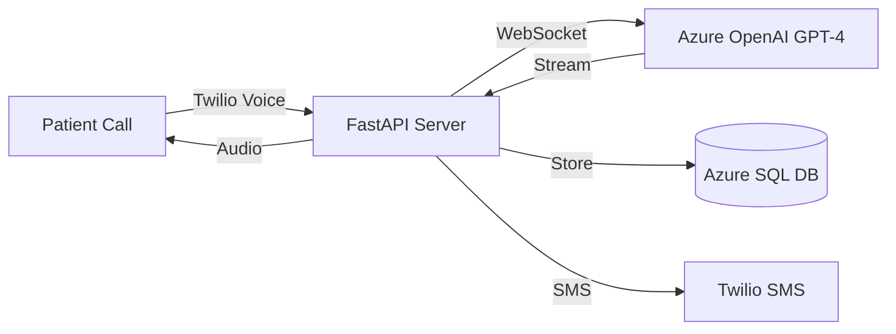
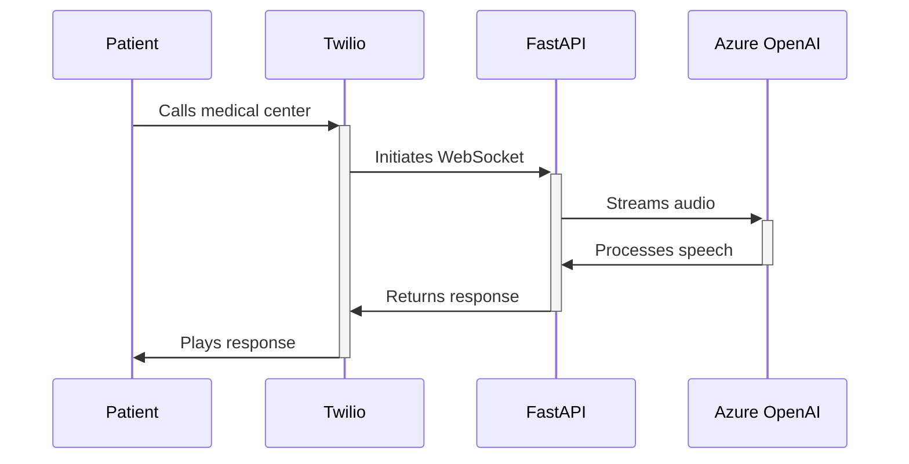

<p align="center">
  <h1 align="center">📱 Azure OpenAI Medical Phone Appointments</h1>
  <p align="center">An intelligent phone-based appointment scheduling system powered by Azure OpenAI GPT-4 and Twilio, featuring real-time voice interactions and natural language processing.</p>
</p>

<p align="center">
  <a href="#features">Features</a> •
  <a href="#architecture">Architecture</a> •
  <a href="#getting-started">Getting Started</a> •
  <a href="#configuration">Configuration</a> •
  <a href="#development-setup">Development</a> •
  <a href="#contributing">Contributing</a>
</p>

<p align="center">
  <a href="https://azure.microsoft.com/"></a>
  <a href="https://openai.com/"></a>
  <a href="https://www.twilio.com/"></a>
  <a href="https://fastapi.tiangolo.com/"></a>
  <a href="https://www.python.org/"></a>
  <a href="https://opensource.org/licenses/MIT"></a>
</p>

<div align="center">
  
  ### 🌟 Based on Tutorial By Nitish 🌟
  
  [](https://www.youtube.com/watch?v=pMCx9TXUZUw)
  [](https://www.linkedin.com/in/nitishmalang/)
  [](https://github.com/Nitish-888)

  *Please ensure to give proper credit when using or adapting this project*
  
</div>

### 🌟 Features

- 🎯 Real-time voice interactions using GPT-4
- 📞 Phone-based appointment scheduling
- 🤖 Natural language understanding
- ✨ Automated voice responses
- 📝 Appointment information collection
- 📱 SMS confirmations
- 🔄 Real-time availability checks
- 🌐 Multi-language support

### 🏗️ Architecture



### 🔄 Data Flow
## Incoming Call


### 🛠️ Tech Stack
```html
Backend Framework: FastAPI
AI Model: Azure OpenAI GPT-4
Voice Services: Twilio
Database: Azure SQL
Runtime: Python 3.8+
WebSocket: asyncio/websockets
Deployment: Azure App Service
```
### 🚀 Quick Start
## 1. Clone the repository
```bash
git clone https://github.com/yourusername/azure-openai-phone-appointments.git
cd azure-openai-phone-appointments

## Set up environment variables

cp .env.example .env
## Configure the following in .env:
OPENAI_API_KEY=your_azure_openai_key
OPENAI_API_ENDPOINT=your_azure_endpoint
PORT=5050

